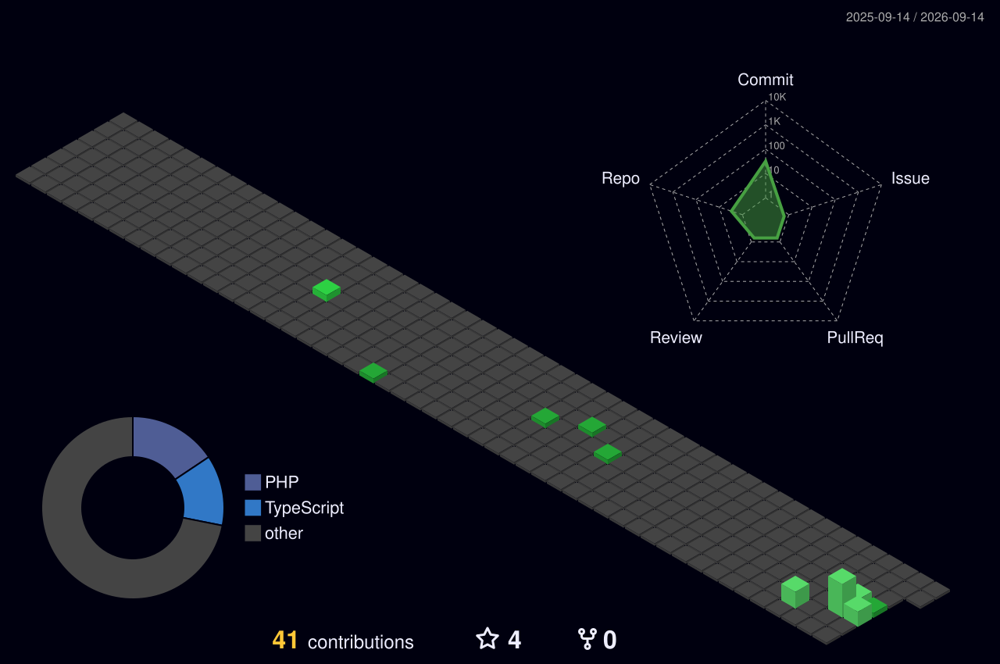

  

## 📌 About Me
- I am a passionate web developer who enjoys building clean, responsive, and user-centered digital experiences.
- I focus on writing structured and maintainable code while transforming ideas into functional web applications. Beyond programming, I am also interested in photography and videography, especially visual storytelling and creative content production.

## 🧠 My Focus Areas
- Full Stack Programming
- Web Development
- Photography and Videography

## 📊 GitHub Stats & Trophies

  

## 🛠️ Languages & Tools

<h3 align="center">Programming Languages</h3>

  &nbsp;&nbsp;
  &nbsp;&nbsp;
  &nbsp;&nbsp;
  &nbsp;&nbsp;
  &nbsp;&nbsp;
  &nbsp;&nbsp;
  

<h3 align="center">Frontend</h3>

  &nbsp;&nbsp;
  &nbsp;&nbsp;
  &nbsp;&nbsp;
  &nbsp;&nbsp;
  &nbsp;&nbsp;
  

<h3 align="center">Backend</h3>

  &nbsp;&nbsp;
  &nbsp;&nbsp;
  

<h3 align="center">Database</h3>

  &nbsp;&nbsp;
  &nbsp;&nbsp;
  

<h3 align="center">DevOps & Cloud</h3>

  &nbsp;&nbsp;
  &nbsp;&nbsp;
  &nbsp;&nbsp;
  

<h3 align="center">Tools</h3>

  &nbsp;&nbsp;
  &nbsp;&nbsp;
  &nbsp;&nbsp;
  

  

<picture>
  <source media="(prefers-color-scheme: dark)" srcset="https://raw.githubusercontent.com/tobiasmeyhoefer/tobiasmeyhoefer/output/github-snake-dark.svg" />
  <source media="(prefers-color-scheme: light)" srcset="https://raw.githubusercontent.com/tobiasmeyhoefer/tobiasmeyhoefer/output/github-snake.svg" />
  
</picture>

  

